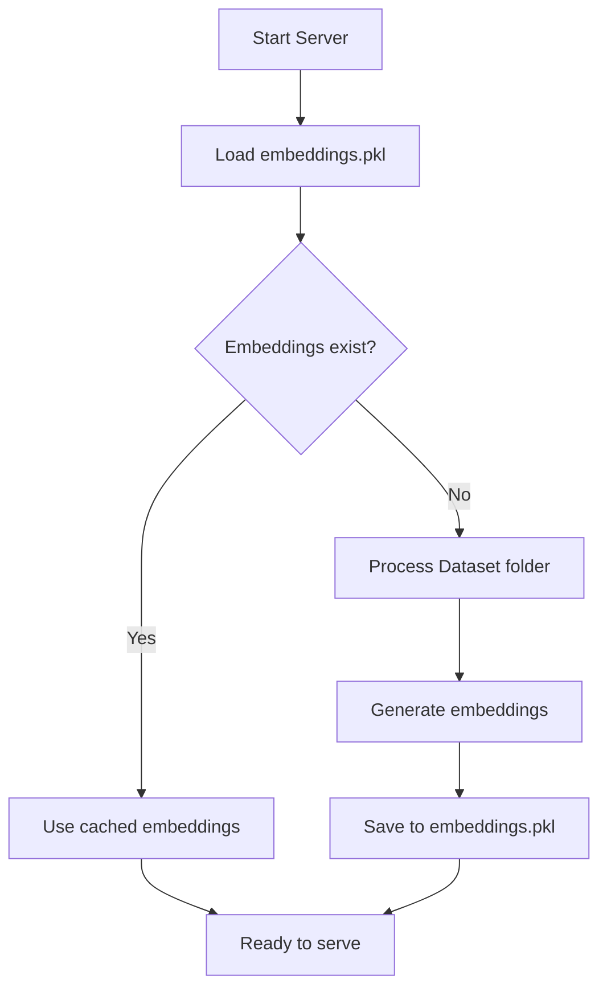
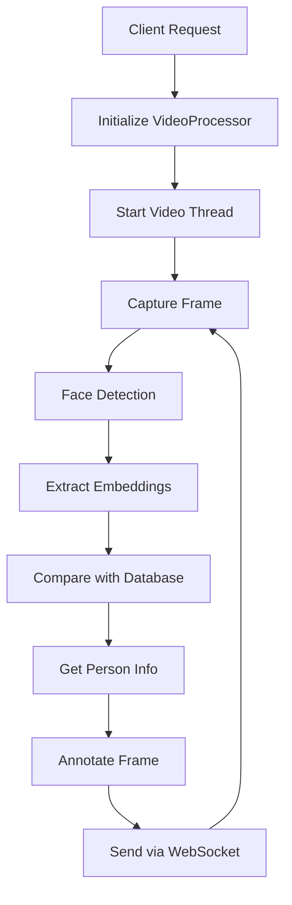
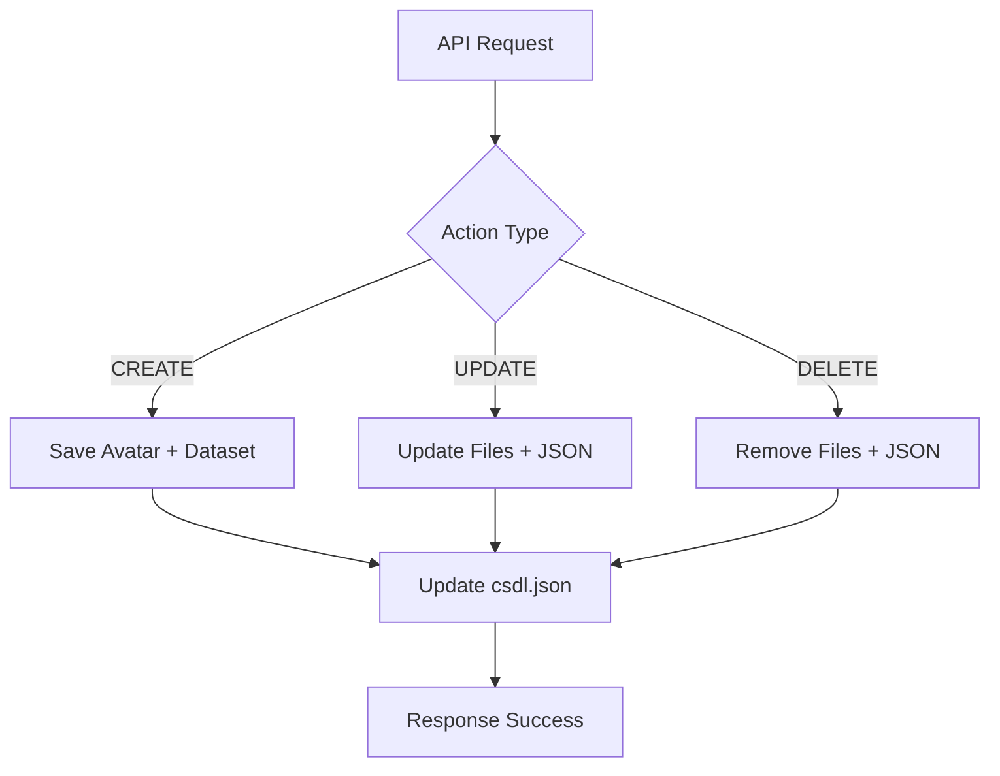

# Tài Liệu Dự Án: Hệ Thống Nhận Diện Khuôn Mặt Các Đối Tượng Trong Blacklist

## 📋 Tổng Quan Dự Án

Hệ thống nhận diện khuôn mặt real-time được xây dựng bằng Python, sử dụng FastAPI và InsightFace để phát hiện, nhận diện khuôn mặt từ video/camera và quản lý thông tin cá nhân.

## 🎥 Video Demo

Xem video demo hoạt động của hệ thống tại: **[https://youtu.be/0nZeFgcfWTA](https://youtu.be/0nZeFgcfWTA)**

### Thông Tin Cơ Bản

- **Ngôn ngữ**: Python
- **Framework**: FastAPI
- **AI Model**: InsightFace (buffalo_sc)
- **Database**: JSON + Pickle (embeddings)
- **Communication**: WebSocket + REST API

---

## 🏗️ Kiến Trúc Hệ Thống

### Cấu Trúc Thư Mục
```
Server_Face_Recognition/
├── main.py                 # API server chính
├── embeddings.pkl         # Cache embeddings của faces
├── Core/                  # Thư viện core
│   ├── face_recognition.py    # Xử lý nhận diện khuôn mặt
│   ├── information.py         # Quản lý thông tin cá nhân
│   └── sock.py               # WebSocket manager
├── Data/                  # Dữ liệu ứng dụng
│   ├── csdl.json             # Database thông tin cá nhân
│   ├── avatar/               # Ảnh đại diện
│   └── video/                # Video upload
├── Dataset/               # Training dataset
│   ├── Person1/              # Thư mục ảnh của từng người
│   ├── Person2/
│   └── ...
└── model/                 # AI models
    ├── det_500m.onnx
    └── w600k_mbf.onnx
```

---

## 🔧 Các Thành Phần Chính

### 1. FaceRecognitionSystem (`Core/face_recognition.py`)

**Chức năng**: Phát hiện và nhận diện khuôn mặt sử dụng InsightFace

**Các phương thức chính**:
- `__init__()`: Khởi tạo model với GPU/CPU support
- `process_database_folder()`: Xử lý dataset để tạo embeddings
- `get_face_embedding()`: Trích xuất embedding từ ảnh
- `recognize_face()`: So sánh embedding với database
- `process_image()`: Xử lý frame và trả về kết quả nhận diện

**Tham số quan trọng**:
- `threshold = 18`: Ngưỡng nhận diện (distance)
- `det_size = (640, 640)`: Kích thước input cho detection
- `model_name = 'buffalo_sc'`: Model InsightFace

### 2. InformationSystem (`Core/information.py`)

**Chức năng**: Quản lý và tra cứu thông tin cá nhân

**Các phương thức**:
- `information_retrieval(name)`: Lấy thông tin từ csdl.json
- `__extract_CSDL()`: Đọc database JSON

### 3. VideoProcessor (`main.py`)

**Chức năng**: Xử lý video/camera real-time với threading

**Quy trình hoạt động**:
1. Khởi tạo camera/video source
2. Chạy thread `_process_frames()` để xử lý frame
3. Mỗi frame: detect → recognize → get info → annotate
4. Lưu kết quả thread-safe với lock
5. Gửi data qua WebSocket

### 4. ConnectionManager (`Core/sock.py`)

**Chức năng**: Quản lý WebSocket connections

**Các phương thức**:
- `connect()`: Tạo connection mới với UUID
- `disconnect()`: Ngắt kết nối
- `send_personal_message()`: Gửi data cho client cụ thể

---

## 🌐 API Endpoints

### REST API

#### 1. `GET /profileblacklist/`
- **Mục đích**: Lấy toàn bộ database csdl.json
- **Response**: Danh sách tất cả người và thông tin

#### 2. `POST /facialrecognition/`
- **Mục đích**: Khởi tạo xử lý video/camera
- **Parameters**:
  - `camera: bool` - Sử dụng camera hay không
  - `video: UploadFile` - File video upload (optional)
- **Logic**: 
  - camera=True, video=None → Dùng camera
  - camera=False, video!=None → Dùng file video
  - Khởi tạo VideoProcessor

#### 3. `GET /video-stream`
- **Mục đích**: Stream video đã được annotate
- **Response**: Multipart stream MJPEG

#### 4. `POST /create_data/`
- **Mục đích**: Thêm người mới vào hệ thống
- **Parameters**:
  - `avata: UploadFile` - Ảnh đại diện
  - `name: str` - Tên (key)
  - `full_name: str` - Họ tên đầy đủ
  - `year_of_birth: str` - Năm sinh
  - `hometown: str` - Quê quán
  - `id_number: str` - Số CMND/CCCD
  - `violation: str` - Vi phạm
  - `data: List[UploadFile]` - Ảnh training

#### 5. `PATCH /update_data/`
- **Mục đích**: Cập nhật thông tin người đã có
- **Parameters**: Tương tự create_data (optional fields)

#### 6. `DELETE /delete_data/`
- **Mục đích**: Xóa người khỏi hệ thống
- **Parameters**: `name: str`
- **Logic**: Xóa avatar, dataset folder, record trong JSON

#### 7. `POST /update_model/`
- **Mục đích**: Cập nhật lại embeddings model
- **Logic**: Re-process Dataset folder → Lưu embeddings.pkl

### WebSocket

#### `WebSocket /supervision_streaming/`
- **Mục đích**: Stream real-time recognition data
- **Input từ client**:
  ```json
  {
    "path": "video_path",
    "action": "off"  // để dừng
  }
  ```
- **Output tới client**:
  ```json
  {
    "profile": {
      "detections": [
        {
          "avata": "path",
          "full_name": "name",
          "year_of_birth": "year",
          // ... other info
        }
      ],
      "timestamp": 1234567890
    }
  }
  ```

---

## 🔄 Luồng Hoạt Động Chi Tiết

### 1. Khởi Tạo Hệ Thống


### 2. Xử Lý Nhận Diện Real-time


### 3. Quản Lý Dữ Liệu


---

## 💾 Cấu Trúc Dữ Liệu

### Database JSON (csdl.json)
```json
{
  "PersonName": {
    "avata": "Data/avatar/PersonName.png",
    "full_name": "Họ Tên Đầy Đủ",
    "year_of_birth": "1990",
    "hometown": "Địa chỉ",
    "id_number": "123456789",
    "violation": "Mô tả vi phạm",
    "data": [
      "Dataset/PersonName/image1.jpg",
      "Dataset/PersonName/image2.jpg"
    ]
  }
}
```

### Embeddings Format (embeddings.pkl)
```python
{
  "PersonName": numpy.array([512-dim embedding]),
  "Person2": numpy.array([512-dim embedding]),
  ...
}
```

### WebSocket Message Format
```json
{
  "profile": {
    "detections": [
      {
        "avata": "path_to_avatar",
        "full_name": "person_name",
        "year_of_birth": "birth_year",
        "hometown": "address",
        "id_number": "id",
        "violation": "violation_info"
      }
    ],
    "timestamp": 1691234567.89
  }
}
```

---

## ⚙️ Cấu Hình và Tham Số

### Face Recognition Parameters
- **Detection threshold**: 18 (distance metric)
- **Model**: buffalo_sc (InsightFace)
- **Detection size**: 640x640
- **GPU support**: Có (fallback to CPU)

### Video Processing
- **Frame rate**: ~111 FPS (sleep 0.009s)
- **Threading**: Separated processing thread
- **Thread safety**: Mutex lock cho frame data

### WebSocket
- **Connection management**: UUID-based
- **Auto reconnect**: Không (client handle)
- **Message format**: JSON

---

## 🚀 Cách Triển Khai

### Yêu Cầu Hệ Thống
```bash
# Cài đặt dependencies
pip install fastapi uvicorn
pip install insightface
pip install opencv-python
pip install numpy
pip install pynput
```

### Chạy Server
```bash
uvicorn main:app --reload --host 0.0.0.0 --port 8000
```

### Cấu Trúc Dataset
```
Dataset/
├── Person1/
│   ├── img1.jpg
│   ├── img2.jpg
│   └── ...
└── Person2/
    ├── img1.jpg
    └── ...
```

---

## 🔒 Bảo Mật và Hiệu Suất

### Bảo Mật
- CORS enabled cho tất cả origins (*)
- Không có authentication
- File upload validation cơ bản

### Hiệu Suất
- **Threading**: Video processing trong thread riêng
- **Caching**: Embeddings được cache trong file
- **Memory**: Load toàn bộ embeddings vào RAM
- **GPU**: Hỗ trợ CUDA acceleration

### Limitations
- Đồng thời chỉ 1 video stream
- Không có rate limiting
- Memory usage tăng theo số người trong database

---

## 🛠️ Troubleshooting

### Lỗi Thường Gặp

1. **Model không load được**
   - Kiểm tra thư mục `model/` có file .onnx
   - Cài đặt đúng version InsightFace

2. **GPU không hoạt động**
   - Cài đặt CUDA và cuDNN
   - Kiểm tra onnxruntime-gpu

3. **Camera không mở được**
   - Kiểm tra camera index (0, 1, 2...)
   - Permissions trên Linux

4. **WebSocket disconnect**
   - Kiểm tra network connection
   - Handle reconnection ở client

### Debug Commands
```bash
# Kiểm tra GPU
python -c "import onnxruntime; print(onnxruntime.get_available_providers())"

# Test camera
python -c "import cv2; cap=cv2.VideoCapture(0); print(cap.isOpened())"
```

---

## 📈 Tối Ưu và Mở Rộng

### Performance Optimization
- Sử dụng GPU cho inference
- Batch processing nhiều faces
- Optimize image resolution
- Database indexing

### Feature Extensions
- Multiple camera support
- User authentication
- Real-time alerts
- Face tracking across frames
- Analytics dashboard

### Scalability
- Microservices architecture
- Database migration (PostgreSQL/MongoDB)
- Message queue (Redis/RabbitMQ)
- Load balancing

---

## 📞 Liên Hệ và Hỗ Trợ

Dự án được phát triển bởi: **Bùi Xuân Hùng**

Email: hungthor1998@gmail.com

Để được hỗ trợ hoặc báo lỗi, vui lòng tạo issue hoặc liên hệ trực tiếp.

---

*Tài liệu được cập nhật: August 4, 2025*
